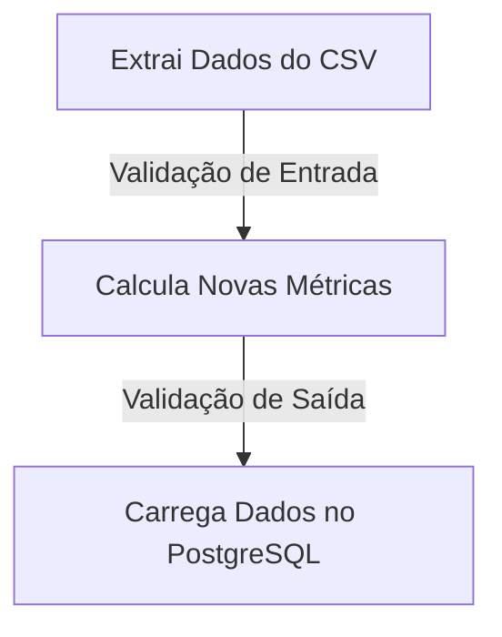
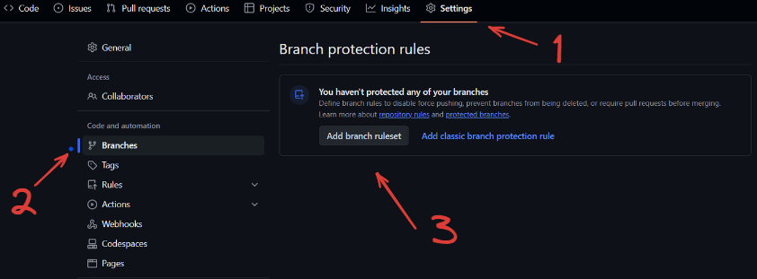
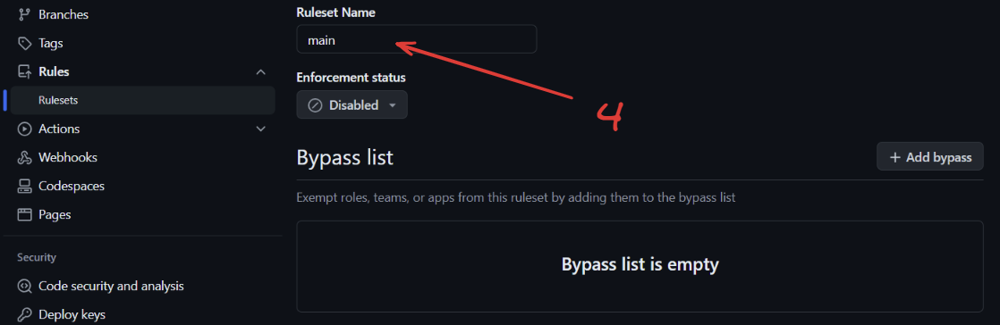
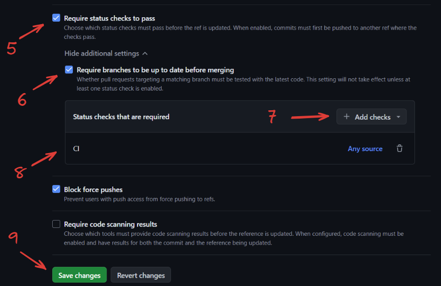

# Qualidade em Dados com Pandera - ao vivo

Este repositório contém a implementação de uma pipeline ETL utilizando a biblioteca [Pandera](https://pandera.readthedocs.io/en/stable/) para validação de contratos de dados em forma de DataFrame. O material foi apresentado em uma [live no Youtube](https://www.youtube.com/live/IQtuWsNmB4o?si=PZKjIWlbJ7-fMmjF) no canal do [Luciano Galvão Filho](https://youtube.com/@lvgalvaofilho?si=RDqx_RCLbtXWTPxH).

Os dados são extraídos de um arquivo CSV local, transformados e inseridos em um banco de dados PostgreSQL. Durante o processo, os dados passam por validação em duas etapas: a primeira ocorre ao serem lidos diretamente do arquivo CSV, e a segunda é realizada após a transformação dos dados.



Adicionalmente, foram implementados testes unitários para as validações dos Schemas utilizando [pytest](https://docs.pytest.org/en/8.2.x/), integrados com uma rotina de CI utilizando GitHub Actions para todas as *pull requests*.

O servidor do banco de dados PostgreSQL, assim como o *client* PGAdmin, foram criados localmente utilizando Docker.

## Sumário

- [Contexto](#contexto)
- [Pandera](#pandera)
- [Testes com Pytest](#testes-com-pytest)
- [CI com GitHub Actions](#ci-com-github-actions)
- [Instruções para executar este projeto localmente](#instruções-para-executar-este-projeto-localmente)

## Contexto

O arquivo [`data/dados_financeiros.csv`](data/dados_financeiros.csv) contém o resultado operacional de uma empresa que possui três setores diferentes: vendas, manutenção e reparação. O objetivo é criar uma ETL que leia esses dados, calcule algumas métricas operacionais e carregue os dados em um banco PostgreSQL. Durante o processo, os dados devem seguir a seguinte regra de negócio:

- Dados ao entrar:

| Nome da Coluna            | Tipo de Dados    | Restrições                                           |
|---------------------------|------------------|------------------------------------------------------|
| setor_da_empresa          | string           | deve iniciar com 'VND_', 'REP_' ou 'MNT_'                                              |
| receita_operacional       | float            | maior ou igual a 0                            |
| data                      | DateTime         | Nenhuma                                              |
| percentual_de_imposto     | float            | entre 0 e 1 |
| custo_operacionais        | float            | maior ou igual a 0                            |

- Dados após transformação:

| Nome da Coluna            | Tipo de Dados    | Restrições                                           |
|---------------------------|------------------|------------------------------------------------------|
| setor_da_empresa          | string           | deve iniciar com 'VND_', 'REP_' ou 'MNT_'                                              |
| receita_operacional       | float            | maior ou igual a 0                            |
| data                      | DateTime         | Nenhuma                                              |
| percentual_de_imposto     | float            | entre 0 e 1 |
| custo_operacionais        | float            | maior ou igual a 0                            |
| valor_do_imposto          | float            | maior ou igual a 0                            |
| custo_total               | float            | maior ou igual a 0                            |
| receita_liquida           | float            | maior ou igual a 0                            |
| margem_operacional        | float            | maior ou igual a 0                            |
| transformado_em           | DateTime (opcional) | Nenhuma                                           


## Pandera

> *"Data validation for scientists, engineers, and analysts seeking correctness."*

[Pandera](https://pandera.readthedocs.io/en/stable/index.html) é um projeto open source da Union.ai que oferece uma API flexível e expressiva para realizar validação de dados em objetos semelhantes a dataframes, tornando os pipelines de processamento de dados mais legíveis e robustos.

Integrações:

```bash
pip install 'pandera[hypotheses]'  # verificações de hipóteses
pip install 'pandera[io]'          # utilitários de IO para esquemas yaml/script
pip install 'pandera[strategies]'  # estratégias de síntese de dados
pip install 'pandera[mypy]'        # habilita a verificação estática de tipos do pandas
pip install 'pandera[fastapi]'     # integração com FastAPI
pip install 'pandera[dask]'        # validação de dataframes Dask
pip install 'pandera[pyspark]'     # validação de dataframes PySpark
pip install 'pandera[modin]'       # validação de dataframes Modin
pip install 'pandera[modin-ray]'   # validação de dataframes Modin com Ray
pip install 'pandera[modin-dask]'  # validação de dataframes Modin com Dask
pip install 'pandera[geopandas]'   # validação de geodataframes GeoPandas
pip install 'pandera[polars]'      # validação de dataframes Polars
```

#### DataFrame Models

Abaixo segue o *Schema* do contrato de dados utilizado no projeto na entrada dos dados.

```python
import pandera as pa
import pandas as pd
from pandera.typing import Series

class MetricasFinanceirasBase(pa.DataFrameModel):
    setor_da_empresa: Series[str]
    receita_operacional: Series[float] = pa.Field(ge=0)
    data: Series[pa.DateTime] 
    percentual_de_imposto: Series[float] = pa.Field(in_range= {"min_value": 0, "max_value": 1})
    custo_operacionais: Series[float] = pa.Field(ge=0)

    class Config: 
        strict = True
        coerce = True
    
    @pa.check(
            "setor_da_empresa", # <--- Coluna que vai receber a checagem customizada
            name = "Checagem código dos setores",
            error = "Cógido do setor da empresa é inválido")
    def checa_codigo_setor(cls, codigo: Series[str]) -> Series[bool]:
        return codigo.str[:4].isin(['REP_', 'MNT_', 'VND_'])
```
- A classe `MetricasFinanceirasBase` herda de `pa.DataFrameModel` e define o *schema* com as colunas/índices sendo atributos de classes. 

- [pa.Field](https://pandera.readthedocs.io/en/stable/reference/generated/pandera.api.dataframe.model_components.Field.html) contém os argumentos nativos da biblioteca e representa características específicas de cada coluna/índice. A lista completa está em [Check](https://pandera.readthedocs.io/en/stable/reference/generated/pandera.api.checks.Check.html#pandera.api.checks.Check).

- Com o decorator [@pa.check](https://pandera.readthedocs.io/en/stable/dataframe_models.html#custom-checks) podemos criar checagens customizadas. 

- Em [class Config](https://pandera.readthedocs.io/en/stable/dataframe_models.html#config) podemos estabelecer opções de esquema geral.
    - `coerce` define se a classe, ao validar, vai tentar converter a Coluna para o tipo de dados estabelecido.
    - `strict` estabelece que a validação não aceita colunas adicionais além das que estão na classe.

- Lista dos [tipos de dados](https://pandera.readthedocs.io/en/stable/reference/dtypes.html#api-dtypes) que o pandera aceita.

Abaixo o modelo criado para o *Schema* do contrato de dados após sua transformação.
```python
class MetricasFinanceirasOut(MetricasFinanceirasBase):
    valor_do_imposto: Series[float] = pa.Field(ge=0)
    custo_total: Series[float] = pa.Field(ge=0)
    receita_liquida: Series[float] = pa.Field(ge=0)
    margem_operacional: Series[float] = pa.Field(ge=0)
    transformado_em: Optional[pa.DateTime]

    @pa.dataframe_check
    def checa_margem_operacional(cls, df:pd.DataFrame) -> Series[bool]:
        return df["margem_operacional"] == (df["receita_liquida"] / df["receita_operacional"]) 
```

- Sendo apenas uma extensão dos dados de entrada, a classe `MetricasFinanceirasOut` herda da classe `MetricasFinanceirasBase`.

- O decorador `@pa.dataframe_check` é utilizado para criarmos checagens a nível do dataframe. Esta abordagem difere do decorador `@pa.check`, que chega a nível de colunas isoladas.


#### Aplicando as validações de Contrato

-  Com Decoradores:

    - `@pa.check_input(<CONTRATO_ENTRADA>)`: Checa os dados na entrada da função.
    - `@pa.check_output(<CONTRATO_SAÍDA>)`: Checa os dados na saída da função.
    - `@pa.check_io(df1 =<CONTRATO_ENTRADA> , df2 = <CONTRATO_ENTRADA>,  output = <CONTRATO_SAÍDA>)`: Checa os dados na entrada e na saida da função.

- Chamando diretamente o método `.validate()` da classe criada e passando o dataframe a ser validado como argumento.
```python
MetricasFinanceirasBase.validate(df)
```

## Testes com Pytest

O framework [pytest](https://docs.pytest.org/en/8.2.x/) facilita a escrita de testes pequenos e legíveis, e pode escalar para suportar testes funcionais complexos para aplicações e bibliotecas.

A estrutura utilizada para criarmos testes unitários dos contratos de dados criados com o Pandera foi:
```python
def test_<NOME_DO_TESTE>():
    df_test = pd.DataFrame(
        {<ESTRUTURA-DO-DF>}
    )

    MetricasFinanceirasBase.validate(df_test) 

    # ou

    with pytest.raises(pa.errors.SchemaError):
        MetricasFinanceirasBase.validate(df_test) # Para quebra do contrato de dados
```

Para rodar os testes:
```bash
pytest test/<ARQUIVO-DO-TESTE> -v
```

A *flag* `-v` serve para vermos todos os resultados dos testes no terminal.

## CI com GitHub Actions

Para criar uma rotina de Integração Contínua (CI) utilizando GitHub Actions, você deve criar um arquivo `ci.yaml` dentro da pasta `.github/workflows`.

Para ativar o *merge* de novas *pull requests* apenas se passar nos testes, siga os passos abaixo:

1. Vá para **Configurações**.
2. Selecione **Branches** no menu lateral esquerdo.
3. Clique em **Adicionar regra de proteção de branch**.




4. Escolha o nome da regra (qualquer um que você desejar).



5. Marque a caixa para **Exigir que verificações de status sejam aprovadas**.
6. Marque a caixa para **Exigir que os branches estejam atualizados antes da fusão**.
7. Clique em **Adicionar verificações**.
8. Escolha o nome da verificação.
9. Salve as alterações.




## Instruções para executar este projeto localmente

