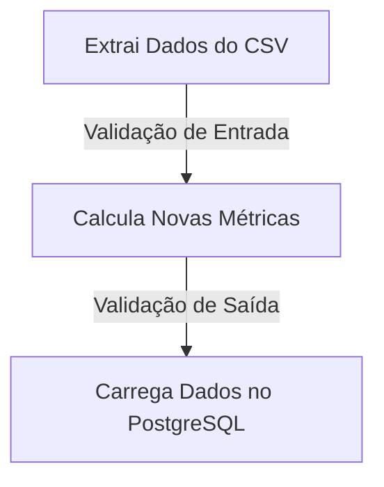

# Qualidade em Dados com Pandera - ao vivo

Este repositório contém a implementação de uma pipeline ETL utilizando a biblioteca [Pandera](https://pandera.readthedocs.io/en/stable/) para validação de contratos de dados em forma de DataFrame. O material foi apresentado em uma [live no Youtube](https://www.youtube.com/live/IQtuWsNmB4o?si=PZKjIWlbJ7-fMmjF) no canal do [Luciano Galvão Filho](https://youtube.com/@lvgalvaofilho?si=RDqx_RCLbtXWTPxH).

Os dados são extraídos de um arquivo CSV local, transformados e inseridos em um banco de dados PostgreSQL. Durante o processo, os dados passam por validação em duas etapas: a primeira ocorre ao serem lidos diretamente do arquivo CSV, e a segunda é realizada após a transformação dos dados.



Adicionalmente, foram implementados testes unitários para as validações dos Schemas utilizando [pytest](https://docs.pytest.org/en/8.2.x/), integrados com uma rotina de CI utilizando GitHub Actions para todas as *pull requests*.

## Sumário

- [Contexto](#contexto)
- [Pandera](#pandera)
- [Testes com Pytest](#testes-com-pytest)
- [CI com GitHub Actions](#ci-com-github-actions)
- [Instruções para executar este projeto localmente](#instruções-para-executar-este-projeto-localmente)

## Contexto

## Pandera

> *"Data validation for scientists, engineers, and analysts seeking correctness."*

#### DataFrame Models

Abaixo segue o *Schema* do contrato de dados utilizado no projeto.

```python
import pandera as pa
import pandas as pd
from pandera.typing import Series

class MetricasFinanceirasBase(pa.DataFrameModel):
    setor_da_empresa: Series[str]
    receita_operacional: Series[float] = pa.Field(ge=0)
    data: Series[pa.DateTime] 
    percentual_de_imposto: Series[float] = pa.Field(in_range= {"min_value": 0, "max_value": 1})
    custo_operacionais: Series[float] = pa.Field(ge=0)

    class Config: 
        strict = True
        coerce = True
    
    @pa.check(
            "setor_da_empresa", # <--- Coluna que vai receber a checagem customizada
            name = "Checagem código dos setores",
            error = "Cógido do setor da empresa é inválido")
    def checa_codigo_setor(cls, codigo: Series[str]) -> Series[bool]:
        return codigo.str[:4].isin(['REP_', 'MNT_', 'VND_'])
```
- A classe `MetricasFinanceirasBase` herda de `pa.DataFrameModel` e define o *schema* com as colunas/índices sendo atributos de classes. 

- [pa.Field](https://pandera.readthedocs.io/en/stable/reference/generated/pandera.api.dataframe.model_components.Field.html) contém os argumentos nativos da biblioteca e representa características específicas de cada coluna/índice. A lista completa está em [Check](https://pandera.readthedocs.io/en/stable/reference/generated/pandera.api.checks.Check.html#pandera.api.checks.Check).

- Com o decorator [@pa.check](https://pandera.readthedocs.io/en/stable/dataframe_models.html#custom-checks) podemos criar checagens customizadas. 

- Em [class Config](https://pandera.readthedocs.io/en/stable/dataframe_models.html#config) podemos estabelecer opções de esquema geral.
    - `coerce` define se a classe, ao validar, vai tentar converter a Coluna para o tipo de dados estabelecido.
    - `strict` estabelece que a validação não aceita colunas adicionais além das que estão na classe.

- Lista dos [tipos de dados](https://pandera.readthedocs.io/en/stable/reference/dtypes.html#api-dtypes) que o pandera aceita.


#### Aplicando as validações de Contrato

-  Com Decoradores:

    - `@pa.check_input(<CONTRATO_ENTRADA>)`: Checa os dados na entrada da função.
    - `@pa.check_output(<CONTRATO_SAÍDA>)`: Checa os dados na saída da função.
    - `@pa.check_io(df1 =<CONTRATO_ENTRADA> , df2 = <CONTRATO_ENTRADA>,  output = <CONTRATO_SAÍDA>)`: Checa os dados na entrada e na saida da função.

- Chamando diretamente o método `.validate()` da classe criada e passando o dataframe a ser validado como argumento.
```python
MetricasFinanceirasBase.validate(df)
```

## Testes com Pytest

## CI com GitHub Actions

## Instruções para executar este projeto localmente
